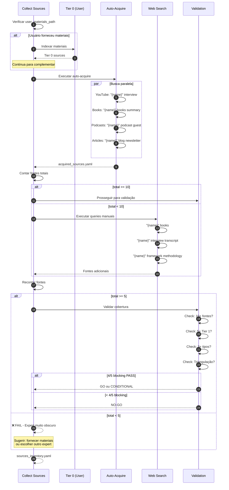
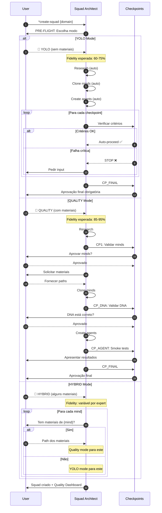
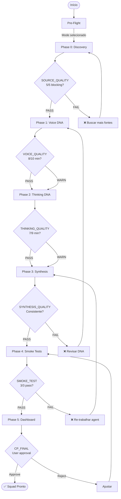

# Squad Creator - Architecture Diagrams

> Diagramas de sequência dos principais fluxos do squad-creator.
>
> Renderize com Mermaid: https://mermaid.live

---

## 1. Fluxo Principal: Criação de Squad

```mermaid
sequenceDiagram
    autonumber
    participant U as User
    participant SA as Squad Architect
    participant MRL as Mind Research Loop
    participant CM as Clone Mind
    participant CA as Create Agent
    participant QG as Quality Gates

    U->>SA: *create-squad {domain}

    rect rgb(40, 40, 60)
        Note over SA: PRE-FLIGHT
        SA->>U: Mostrar requisitos de materiais
        SA->>U: Perguntar modo (YOLO/QUALITY/HYBRID)
        U-->>SA: Selecionar modo
    end

    rect rgb(40, 60, 40)
        Note over SA,MRL: PHASE 1: RESEARCH
        SA->>MRL: Iniciar pesquisa iterativa
        loop 3-5 iterations
            MRL->>MRL: Pesquisar elite minds
            MRL->>MRL: Devil's advocate
            MRL->>MRL: Validar frameworks
        end
        MRL-->>SA: Lista curada de minds
    end

    SA->>U: Apresentar minds encontrados
    U-->>SA: Aprovar minds

    alt QUALITY/HYBRID Mode
        rect rgb(60, 40, 40)
            Note over SA,U: MATERIALS COLLECTION
            SA->>U: Solicitar materiais por mind
            U-->>SA: Fornecer paths/links
        end
    end

    rect rgb(40, 40, 80)
        Note over SA,CA: PHASE 3: CREATION (per mind)
        loop Para cada mind aprovado
            SA->>CM: *clone-mind {name}
            CM-->>SA: mind_dna_complete.yaml
            SA->>CA: *create-agent usando DNA
            CA->>QG: Validar agent
            QG-->>CA: PASS/FAIL
            CA-->>SA: agent.md criado
        end
    end

    SA->>SA: Criar orchestrator
    SA->>SA: Criar workflows/tasks
    SA->>QG: Validação final do squad
    QG-->>SA: Score final

    SA->>U: Squad pronto + Quality Dashboard
```

---

## 2. Fluxo: Clone Mind (DNA Extraction)

```mermaid
sequenceDiagram
    autonumber
    participant U as User
    participant CM as Clone Mind
    participant CS as Collect Sources
    participant AA as Auto-Acquire
    participant VE as Voice Extractor
    participant TE as Thinking Extractor
    participant ST as Smoke Tests

    U->>CM: *clone-mind {name} --domain {domain}

    rect rgb(50, 40, 40)
        Note over CM,CS: PHASE 0: SOURCE COLLECTION
        CM->>CS: Iniciar coleta de fontes

        alt User forneceu materiais
            CS->>CS: Indexar como Tier 0
        else Sem materiais
            CS->>AA: Executar auto-acquire
            AA->>AA: YouTube transcripts
            AA->>AA: Book summaries
            AA->>AA: Podcasts
            AA-->>CS: Fontes encontradas
        end

        alt < 10 fontes
            CS->>CS: Manual web search
        end

        alt < 5 fontes
            CS-->>U: ❌ Expert muito obscuro
            Note over U: Workflow PARA
        else >= 5 fontes
            CS-->>CM: sources_inventory.yaml
        end
    end

    rect rgb(40, 50, 40)
        Note over CM,VE: PHASE 1: VOICE DNA
        CM->>VE: Extrair Voice DNA
        VE->>VE: Power words
        VE->>VE: Signature phrases
        VE->>VE: Stories/anecdotes
        VE->>VE: Anti-patterns
        VE->>VE: Immune system
        VE-->>CM: voice_dna.yaml (8/10 min)
    end

    rect rgb(40, 40, 50)
        Note over CM,TE: PHASE 2: THINKING DNA
        CM->>TE: Extrair Thinking DNA
        TE->>TE: Recognition patterns
        TE->>TE: Frameworks
        TE->>TE: Heuristics
        TE->>TE: Objection handling
        TE->>TE: Handoff triggers
        TE-->>CM: thinking_dna.yaml (7/9 min)
    end

    CM->>CM: Synthesis: Combinar DNAs
    CM->>CM: Gerar mind_dna_complete.yaml

    rect rgb(60, 40, 60)
        Note over CM,ST: PHASE 4: SMOKE TESTS
        CM->>ST: Executar 3 testes
        ST->>ST: Test 1: Domain Knowledge
        ST->>ST: Test 2: Decision Making
        ST->>ST: Test 3: Objection Handling

        alt 3/3 PASS
            ST-->>CM: ✅ Agente validado
        else Qualquer FAIL
            ST-->>CM: ❌ Re-trabalhar DNA
            CM->>VE: Revisar seção que falhou
        end
    end

    CM->>CM: Gerar Quality Dashboard
    CM-->>U: mind_dna_complete.yaml + dashboard
```

---

## 3. Fluxo: Coleta de Fontes (Fallback Chain)

---

## 4. Fluxo: Smoke Tests

```mermaid
sequenceDiagram
    autonumber
    participant AG as Agent.md
    participant ST as Smoke Test Runner
    participant T1 as Test 1: Domain
    participant T2 as Test 2: Decision
    participant T3 as Test 3: Objection
    participant DNA as mind_dna.yaml

    ST->>DNA: Carregar DNA do mind
    DNA-->>ST: voice_dna + thinking_dna

    rect rgb(40, 50, 40)
        Note over ST,T1: TEST 1: CONHECIMENTO
        ST->>AG: "Explique {framework_principal}..."
        AG-->>ST: Resposta
        ST->>T1: Validar resposta
        T1->>T1: Conta power_words (min 3)
        T1->>T1: Verifica signature_phrases (min 1)
        T1->>T1: Verifica never_use (max 0)
        T1->>T1: Valida tom/estrutura
        T1-->>ST: 4/5 checks → PASS/FAIL
    end

    rect rgb(50, 40, 40)
        Note over ST,T2: TEST 2: DECISÃO
        ST->>AG: "Devo fazer A ou B? Por quê?"
        AG-->>ST: Resposta
        ST->>T2: Validar resposta
        T2->>T2: Aplica heurística do DNA?
        T2->>T2: Segue decision_pipeline?
        T2->>T2: Usa framework?
        T2->>T2: Responde com convicção?
        T2-->>ST: 4/5 checks → PASS/FAIL
    end

    rect rgb(40, 40, 50)
        Note over ST,T3: TEST 3: OBJEÇÃO
        ST->>AG: "Discordo porque {objeção}..."
        AG-->>ST: Resposta
        ST->>T3: Validar resposta
        T3->>T3: Reconhece objeção?
        T3->>T3: Usa objection_response do DNA?
        T3->>T3: Mantém convicção?
        T3->>T3: Parece autêntico?
        T3-->>ST: 4/5 checks → PASS/FAIL
    end

    ST->>ST: Consolidar resultados

    alt 3/3 tests PASS
        ST-->>AG: ✅ SMOKE TEST PASSED
        Note over AG: Agente pronto para uso
    else Qualquer test FAIL
        ST-->>AG: ❌ SMOKE TEST FAILED
        Note over AG: Ações:<br/>1. Revisar DNA<br/>2. Adicionar exemplos<br/>3. Re-testar
    end
```

---

## 5. Fluxo: YOLO vs QUALITY Mode

---

## 6. Estrutura de Arquivos do Squad-Creator

```mermaid
graph TD
    subgraph "squads/squad-creator/"
        A[config.yaml] --> B[agents/]
        A --> C[tasks/]
        A --> D[workflows/]
        A --> E[templates/]
        A --> F[checklists/]
        A --> G[data/]
        A --> H[docs/]

        B --> B1[squad-architect.md]
        B --> B2[sop-extractor.md]

        C --> C1[create-squad.md]
        C --> C2[create-agent.md]
        C --> C3[collect-sources.md]
        C --> C4[auto-acquire-sources.md]
        C --> C5[extract-voice-dna.md]
        C --> C6[extract-thinking-dna.md]
        C --> C7[update-mind.md]

        D --> D1[wf-create-squad.yaml]
        D --> D2[wf-clone-mind.yaml]
        D --> D3[mind-research-loop.md]

        E --> E1[agent-tmpl.md]
        E --> E2[quality-dashboard-tmpl.md]

        F --> F1[squad-checklist.md]
        F --> F2[smoke-test-agent.md]
        F --> F3[mind-validation.md]

        H --> H1[HITL-FLOW.md]
        H --> H2[ARCHITECTURE-DIAGRAMS.md]
    end

    subgraph "outputs/minds/{slug}/"
        O1[sources_inventory.yaml]
        O2[voice_dna.yaml]
        O3[thinking_dna.yaml]
        O4[mind_dna_complete.yaml]
        O5[smoke_test_result.yaml]
        O6[quality_dashboard.md]
    end

    D2 --> O1
    D2 --> O2
    D2 --> O3
    D2 --> O4
    D2 --> O5
    D2 --> O6
```

---

## 7. Quality Gates Flow

---

## Como Visualizar

1. **Mermaid Live Editor:** https://mermaid.live
2. **VS Code:** Instalar extensão "Markdown Preview Mermaid Support"
3. **GitHub:** Renderiza automaticamente em arquivos .md
4. **Obsidian:** Suporte nativo a Mermaid

---

**Squad Architect | Architecture Diagrams v1.0**
*"A picture is worth a thousand lines of YAML."*
